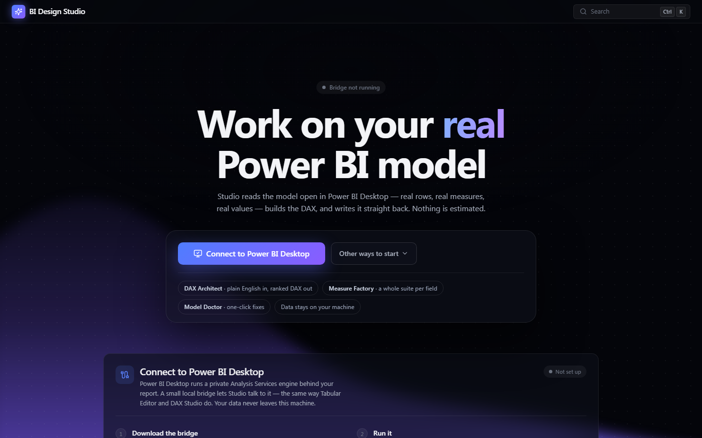

<div align="center">

# ⚡ DAX Workbench

**Work on your *real* Power BI model.**

Workbench reads the model open in Power BI Desktop — real rows, real measures, real values —
builds the DAX, verifies it on Microsoft's own engine, and writes it straight back.
Nothing is estimated, and no AI sits anywhere in that path.

[**Live Workbench**](https://pbi-design-studio.onrender.com) ·
[**Download the bridge**](https://pbi-design-studio.onrender.com/download/DAX-Workbench-Bridge.exe) ·
[Architecture](./docs/ARCHITECTURE.md) ·
[Bridge internals](./tools/pbi-desktop-bridge/README.md)


<br>



</div>

---

## Why this exists

Every "AI writes your DAX" tool shares one failure mode: it produces formulas that *look*
right. A hallucinated filter on a column that exists, against a value that doesn't, returns
a number — not an error — and someone makes a decision on it.

Workbench inverts that. Natural language is parsed into a structured intent and resolved
**against the live model**: the column must exist, the value must appear in that column's
actual data, or the filter is dropped. What survives is matched against a library of
hand-written DAX patterns, each of which emits a known-good shape. The engine can be wrong
about what you *meant*. It cannot invent a column, and it cannot invent a value.

Because generation is deterministic, output is reviewable — Workbench proposes ranked
candidates and **you pick**. Because the model is live, every candidate is **previewed
before you commit**, and verified numbers come from the same Analysis Services engine your
report runs on.

## The three tools

### ƒ DAX Architect
Describe the measure in plain English; Workbench ranks the ways to build it.
- Ranked suggestions with live previews — you choose, it never just guesses
- **Branched build plans**: ask for YoY and get the base total, the prior-year measure, and the growth measure that divides them
- Time intelligence, iterators (`SUMX`/`RELATED`), `VAR`/`RETURN`, `USERELATIONSHIP`, typo-tolerant filters resolved against real data
- **Verify on Desktop** runs the expression on the real engine; **Push to Desktop** writes the measure into your `.pbix`, undoable like any edit
- Learns your phrasing locally (`localStorage`) — picks re-rank future suggestions, and nothing is uploaded

### 🏭 Measure Factory
Pick one numeric field, get its whole analytical suite in a single pass.
- Total, average, YTD/QTD/MTD, prior year, YoY %, MoM %, moving average, running total, % of total, rank
- Each measure generated by the same deterministic engine, previewed, then deployed together with the base measures it branches from

### 🩺 Model Doctor
Audits the live model for what renders badly, scales badly, or breaks quietly.
- Missing format strings — with one-click fixes that write through to Desktop (and text-returning measures correctly exempted)
- `FILTER` over a whole fact table inside `CALCULATE`, with a `KEEPFILTERS` rewrite offered for review
- Division that should be `DIVIDE()`, missing display folders
- Exports a Markdown data dictionary of the whole model

## Wrapped in a full studio

- 📥 **Data** — CSV / Excel / Parquet parsed in a Web Worker; schema inference, column profiling, multi-sheet + side-by-side table splitting, virtualized grid
- 🧠 **Model** — automatic star-schema detection (keys, relationships, fact/dimension/date roles) with an interactive relationship graph
- 🎨 **Design** — drag-and-drop canvas, 21 hand-rendered SVG visual types, 6 dashboard layout recipes, undo/redo, ⌘K command palette
- 📤 **Export** — TMDL, PBIP (zip), interactive HTML, Markdown docs, theme JSON, Tabular Editor C# script
- 🧩 **Plugin SDK** — Workbench's own features register through its public extension points; structural model validation included
- 📂 **Open PBIP/PBIX** — parse a Power BI project's TMDL, bind real data from its source files, honest fallbacks where a format can't be read in a browser

## How the live connector works

Power BI Desktop already runs a private Analysis Services instance behind every open
report. Workbench's entire connection strategy is to find it and speak to it properly — the
same way Tabular Editor and DAX Studio do.

```
┌─────────────────────────  your computer  ─────────────────────────┐
│                                                                   │
│  Power BI Desktop  ◄──TOM / ADOMD──►  Bridge  ◄──HTTP──►  Workbench  │
│  (msmdsrv.exe, your model)     (127.0.0.1:5177)      (in browser) │
│                                                                   │
└───────────────────────────────────────────────────────────────────┘
```

- The **bridge** is a single self-contained ~52 MB `.exe` — a .NET 8 minimal API, ~335
  lines of C#. No installer, no .NET runtime needed, nothing else to set up.
- It discovers Desktop's dynamic port from `msmdsrv.port.txt` (classic **and** Store/MSIX
  install paths), reads/writes the model via **TOM**, runs DAX via **ADOMD**.
- Six endpoints: `/health` `/discover` `/model` `/dax` `/preview` `/measure`. Only
  `/measure` mutates anything — and it refuses to ever write an empty expression.
- **Loopback only by default**, CORS restricted to an exact origin list, and it makes no
  outbound call of its own. Your data never leaves the machine.

### Ship the formula to the data — why measures stay exact at any size

Two very different things travel over the bridge, and only one of them is capped:

**Sync moves raw rows.** When Workbench pulls your model in, each table comes over as
`EVALUATE 'Table'`, capped at **10,000 rows per table** — a deliberate guard on browser
memory and sync time. This sample only feeds the *in-browser* previews: the quick numbers
on suggestion cards and the local mini-DAX evaluator. If a table is larger than 10K, those
local previews become indicative rather than exact.

**Measures move as text.** *Verify on Desktop*, previews against the engine, and deployed
measures never touch the sample. Workbench sends the **DAX expression itself** — a few
hundred bytes — and Analysis Services evaluates it inside Desktop **over every row it
has**, returning just the answer:

```
EVALUATE ROW("v", SUM('Fact_Cases'[TotalBilled]))
→ {"value": 46856025.71}
```

One row comes back whether the fact table holds 600 rows or 60 million — the cap limits
rows *returned*, never rows *computed over*. Photocopying every invoice to add them up
yourself is capped; asking the accountant for the total is not.

| The number you're looking at | Computed from | Exact on huge models? |
|---|---|---|
| Suggestion-card preview / in-browser evaluator | Synced sample (≤10K/table) | Indicative if a table was truncated |
| **Verify on Desktop** | Full data, in Analysis Services | **Always** |
| A deployed measure in your report | Full data, computed by Desktop itself | **Always** |

The proof from a live model: `TotalBilled 3-Month Moving Avg` uses `DATESINPERIOD`, which
the in-browser evaluator doesn't support — it honestly says *preview n/a*. Deployed and
evaluated on the real engine, it returns **125,354.10** over the full data. And a deployed
measure contains no data at all — it's formula text stored in your model, which Desktop
computes in your visuals from then on. The bridge could vanish and the measure would keep
being correct.

### Remote connector

Work on a report that's open on **another machine**: they double-click the bridge and
choose *"[2] This computer AND someone else's Workbench"* — it prints an address and a
one-time **pairing token** (mandatory over the network, fixed-time compared; loopback
stays token-free). Both machines must be on the same network, and Windows Firewall must be
allowed when it asks. On untrusted networks, use the SSH tunnel the dialog suggests
instead — encrypted, no token, no mixed-content restrictions.

## Getting started

**As a user** — nothing to install except the bridge:

1. Open the [live Workbench](https://pbi-design-studio.onrender.com)
2. Download the bridge from the front page and double-click it
   (unsigned binary — Windows will say *unknown publisher*; choose **More info → Run anyway**)
3. Open your report in Power BI Desktop
4. The page notices the bridge on its own — click **Connect**

**As a developer:**

```bash
npm install
npm run dev        # → http://localhost:5173
npm run build      # typecheck + production build
```

```bash
# the bridge (needs the .NET 8 SDK only to BUILD — users never do)
cd tools/pbi-desktop-bridge
run.cmd            # builds a self-contained x64 exe on first run, then launches
run.cmd -rebuild   # after changing bridge source
```

## By the numbers

| | |
|---|---|
| Client | **15,000+ lines** of strict TypeScript across 91 files, Clean Architecture (`domain → application → infrastructure → presentation`) |
| Bridge | **335 lines** of C#, 6 endpoints |
| DAX engine | **229-function catalog**, 22 ranked intent patterns, 2,194-line deterministic rules engine, 624-line mini-DAX interpreter with row context |
| Visuals | **21 chart types**, hand-rendered SVG — no charting library |
| Runtime dependencies | **8** — react, react-dom, zustand, papaparse, xlsx, hyparquet, fflate, lucide-react |

## Privacy

Not a policy — a consequence of how it's built. The Workbench is a static page with **no
backend**: no account, no sign-in, no analytics, no error reporting, no third-party
scripts, no external fonts. The app makes exactly **one kind of network call — to the
bridge on your own machine** — and the bridge talks to Power BI Desktop and nothing else.
Your model changes only when you explicitly push, deploy, or apply a fix, and every write
is undoable in Desktop.

## Documentation

- [Architecture](./docs/ARCHITECTURE.md) — philosophy, layers, engines, state, plugins
- [Roadmap](./docs/ROADMAP.md) — milestone plan (M0 → M8, all shipped)
- [Bridge](./tools/pbi-desktop-bridge/README.md) — endpoints, discovery, remote mode, security model

## Project layout

```
src/
  domain/          pure types — SemanticModel, Report, VisualKind (zero imports)
  application/     the engine room — dax/ (architect, intent, evaluator, factory,
                   doctor), import/ (+pbi), insights/, query/, export/, plugins/
  infrastructure/  the outside world — bridge client, worker parsing, zip
  presentation/    React only — home, shell, design, data, model, dax, plugins
  app/             composition root — store, commands, DI wiring
  design-system/   tokens + hand-built primitives (no UI framework)
  shared/          Result, EventBus, CommandBus, DI container
tools/
  pbi-desktop-bridge/   .NET 8 bridge — TOM + ADOMD over localhost HTTP
```

---

<div align="center">

Designed with ❤️ by **Rishav K.** — love to hear about your experience.

[LinkedIn](https://www.linkedin.com/in/rishav98kumar) · [Kumar98rishav@gmail.com](mailto:Kumar98rishav@gmail.com)

© 2026 DAX Workbench. All rights reserved.
Not affiliated with or endorsed by Microsoft. Power BI is a trademark of Microsoft Corporation.

</div>
